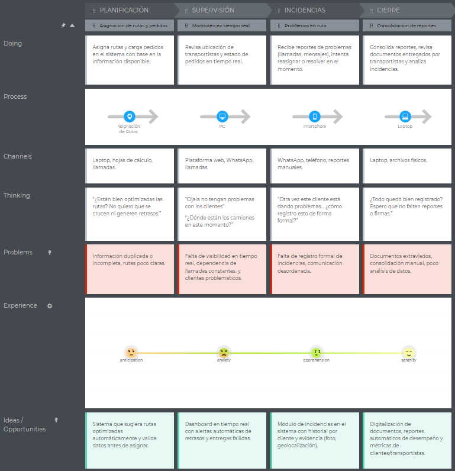
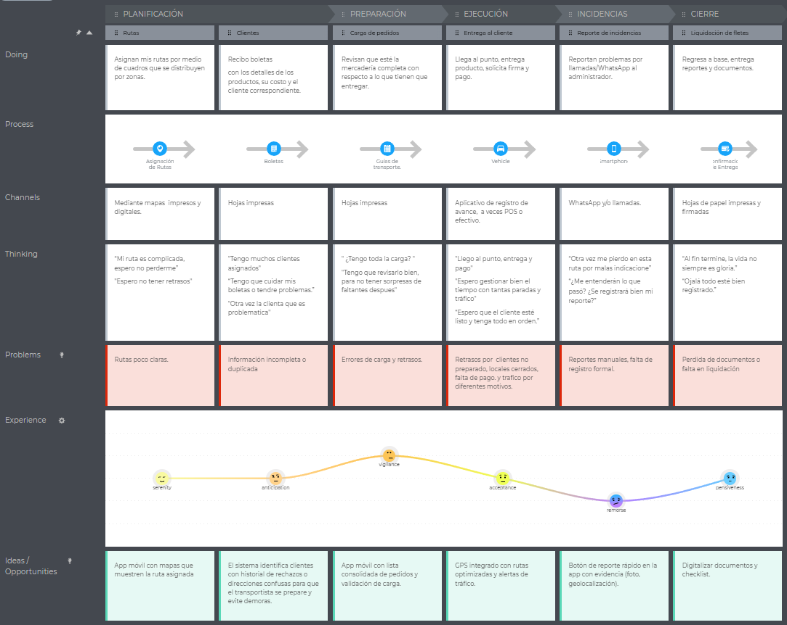
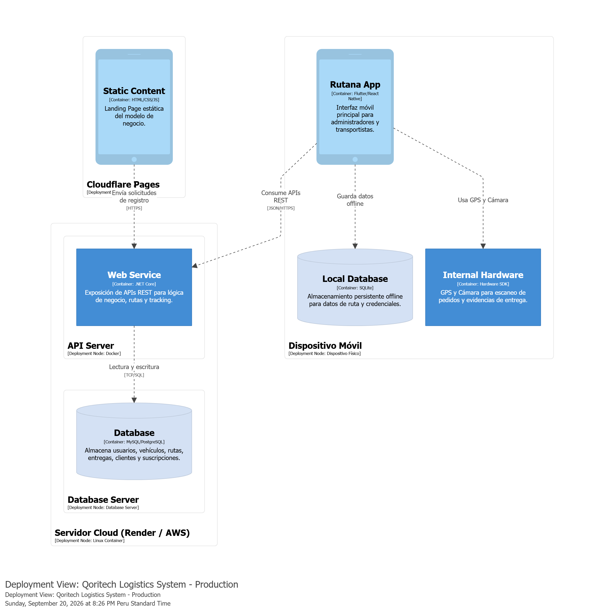

# Capítulo II: Requirements Development and Software Solution Design
## 2.1. Competidores
### 2.1.1. Análisis competitivo
<table style="width:100%; border-collapse:collapse; table-layout:fixed;" border="1" align="center">
  <!-- Título principal -->
  <tr>
    <th colspan="6" align="center">Competitive Analysis Landscape</th>
  </tr>
  <!-- Justificación -->
  <tr>
    <td rowspan="2" align="center"><b>¿Por qué llevar a cabo este análisis?</b></td>
    <td colspan="5" align="center">
      Identificar fortalezas, debilidades y estrategias de los principales competidores en logística de última milla (SimpliRoute, Beetrack, FarEye) para posicionar nuestra aplicación web.
    </td>
  </tr>
  <tr>
    <td colspan="5">
      <b>Objetivo:</b> Determinar cómo diferenciar nuestro producto frente a competidores consolidados en LATAM y globales.   
    </td>
  </tr>
  <!-- Encabezados con logos -->
  <tr>
    <th colspan="2" style="width:20%">(En la cabecera colocar por cada competidor nombre y logo)</th>
    <th style="width:20%">
      
    </th>
    <th style="width:20%">
      
    </th>
    <th style="width:20%">
      
    </th>   
    <th style="width:20%">
      
    </th>
  </tr>
  <!-- PERFIL -->
  <tr>
    <td rowspan="2" align="center"><b>Perfil</b></td>
    <td><b>Overview</b></td>
    <td> Solución tecnológica desarrollada para el mercado peruano que fusiona IoT y GPS para garantizar el seguimiento en vivo, la mejora de rutas y la supervisión de mercancías en tránsito. Está diseñada específicamente para mitigar los retos locales de transporte, tales como la congestión vehicular, los cierres de vías y las variaciones climatológicas. </td>
    <td> Plataforma chilena con fuerte presencia en LATAM; optimización de rutas y seguimiento en tiempo real. </td>
    <td> Fundada en Chile, adquirida por DispatchTrack; fuerte en trazabilidad de última milla. </td>
    <td> Empresa multinacional de origen indio especializada en orquestación de entregas, visibilidad de envíos y gestión inteligente de devoluciones. </td>
  </tr>
  <tr>
    <td><b>Ventaja competitiva: ¿Qué valor ofrece a los clientes?</b></td>
    <td> Ofrece en una sola solución: seguimiento en vivo, validación automatizada de pedidos y alertas inteligentes. Está pensada para pymes peruanas, ayudándolas a reducir errores de entrega, evitar pérdidas y mejorar la puntualidad. </td>
    <td> Reducción de costos logísticos hasta 30% con algoritmos de optimización. </td>
    <td> Experiencia de usuario robusta y alta penetración en empresas medianas/grandes de LATAM. </td>
    <td> Escalabilidad global y capacidad de integración con grandes retailers y 3PL. </td>
  </tr>
  <!-- PERFIL DE MARKETING -->
  <tr>
    <td rowspan="2" align="center"><b>Perfil de Marketing</b></td>
    <td><b>Mercado objetivo</b></td>
    <td> Pequeñas y medianas empresas de transporte y distribución en Perú, con foco inicial en Lima y ciudades con alta informalidad logística como las empresas de provincia también.</td>
    <td> Pymes y grandes empresas de distribución en LATAM. </td>
    <td> Retail, consumo masivo y distribución en varios países de LATAM. </td>
    <td> Retailers, e-commerce y logística global (Asia, Europa, LATAM). </td>
  </tr>
  <tr>
    <td><b>Estrategias de marketing</b></td>
    <td> Evidenciar beneficios cuantitativos (menos errores, más puntualidad) mediante pilotos locales, campañas digitales y casos de éxito adaptados a la realidad peruana.</td>
    <td> Casos de éxito locales, métricas de reducción de costos y demos personalizadas. </td>
    <td> Branding fuerte en trazabilidad y seguridad de entregas; foco en confiabilidad. </td>
    <td> Posicionamiento como solución integral global; alianzas con grandes corporativos. </td>
  </tr>
  <!-- PERFIL DE PRODUCTO -->
  <tr>
    <td rowspan="3" align="center"><b>Perfil de Producto</b></td>
    <td><b>Productos & Servicios</b></td>
    <td> Incluye monitoreo IoT en tiempo real, registro automático de pedidos, panel de control para administradores y alertas de desvíos o incidencias.</td>
    <td> Optimización de rutas, seguimiento en vivo, gestión de flota y analítica. </td>
    <td> PlannerPro (rutas), LastMile (seguimiento), notificaciones y prueba de entrega. </td>
    <td> Administración total de la cadena de distribución, control de logística inversa y trazabilidad instantánea de los envíos. </td>
  </tr>
  <tr>
    <td><b>Precios & Costos</b></td>
    <td> Planes de suscripción flexible y escalonada (básico, estándar y corporativo) adaptados al ecosistema peruano. Permiten iniciar operaciones con un presupuesto reducido y expandir las capacidades conforme la empresa crece. </td> 
    <td> Modelo SaaS flexible según volumen de entregas. </td>
    <td> Suscripción mensual adaptada al tamaño de la operación. </td>
    <td> Tarifas empresariales escalables para operaciones globales. </td>
  </tr>
  <tr>
    <td><b>Canales de distribución (Web y/o Móvil)</b></td>
    <td> El sistema será accesible a través de plataforma web para administradores y conductores, garantizando sincronización en tiempo real entre ambos segmentos. </td>
    <td> Web y app móvil para conductores y administradores. </td>
    <td> Web, app móvil y APIs de integración. </td>
    <td> Plataforma web, apps móviles, integraciones con ERP/CRM. </td>
  </tr>
  <!-- SWOT -->
  <tr>
    <td rowspan="4" align="center"><b>Análisis SWOT</b></td>
    <td><b>Fortalezas</b></td>
    <td> Integración de IoT y validaciones automatizadas que ofrecen una trazabilidad superior a competidores regionales. </td>
    <td> Alta adopción en LATAM; soporte local. </td>
    <td> Reconocimiento de marca y respaldo de DispatchTrack. </td>
    <td> Cobertura global, escalabilidad y capacidad de integración. </td>
  </tr>
  <tr>
    <td><b>Debilidades</b></td>
    <td> Al ser una solución nueva, carece todavía de base de clientes consolidados y casos de éxito reales. </td>
    <td> Menos reconocimiento fuera de LATAM. </td>
    <td> Dependencia de adaptación tras adquisición. </td>
    <td> Puede resultar costosa y compleja para pymes locales. </td>
  </tr>
  <tr>
    <td><b>Oportunidades</b></td>
    <td> Aprovechar el crecimiento acelerado del e-commerce y la digitalización logística en LATAM para posicionarse como alternativa innovadora. </td>
    <td> Crecimiento del e-commerce en LATAM. </td>
    <td> Sinergias con la expansión global de DispatchTrack. </td>
    <td> Expansión en mercados emergentes con alto crecimiento digital. </td>
  </tr>
  <tr>
    <td><b>Amenazas</b></td>
    <td> Competidores consolidados como Beetrack y SimpliRoute ya cuentan con reconocimiento de marca y clientes en el mercado. </td>
    <td> Aparición de nuevos SaaS locales más económicos. </td>
    <td> Competencia fuerte de soluciones globales más completas. </td>
    <td> Regulaciones locales y adaptación cultural en LATAM. </td>
  </tr>
</table>

### 2.1.2. Estrategias y tácticas frente a competidores

Nuestra estrategia frente a competidores como SimpliRoute, Beetrack y FarEye será iniciar con pymes de transporte y distribución en el mercado peruano, ofreciendo una solución accesible y adaptable. A diferencia de los competidores consolidados, priorizaremos la simplicidad de uso, el soporte local y la personalización de funciones según la realidad de cada empresa.

Implementaremos un modelo SaaS modular y escalonado que facilite a las pequeñas empresas una adopción de bajo costo, permitiéndoles expandir capacidades a la par de sus operaciones. Para consolidar la confianza en el mercado nacional, impulsaremos estrategias basadas en pruebas piloto sin costo, validación con casos de éxito locales y un soporte técnico directo y cercano.

Nuestra propuesta de valor destaca por fusionar monitoreo IoT en tiempo real, automatización en la validación de pedidos y un sistema de alertas inteligentes dentro de una plataforma ágil y ligera. Esto se traduce en una reducción drástica de costos operativos, mayor cumplimiento en los tiempos de entrega y una seguridad reforzada frente a los desafíos logísticos del contexto peruano.

### 2.2. Entrevistas.

### 2.2.1. Diseño de entrevistas.

**Preguntas Generales**

**Objetivo:** obtener información personal y de contexto laboral del entrevistado.  
**Presentación con:** Nombres, apellidos, edad.

- **Principal:** ¿Cuál es tu rol dentro de la empresa de transporte?
- **Principal:** ¿Qué responsabilidades tienes en tu área?
- **Complementaria:** ¿Qué herramientas digitales/apps usas ahora para tu trabajo y qué te frustra de ellas?

**Primer Segmento Objetivo: Transportistas**

**Objetivo:** identificar cómo reciben, procesan y ejecutan la información de entregas, así como dificultades comunes en ruta.

- **Principal:** Actualmente, ¿cómo te pasan las ubicaciones de entrega (canal, formato y con cuánta anticipación) y quiénes son los que deciden?
- **Principal:** Si no conoces el lugar, ¿qué haces para encontrar el punto de entrega?
- **Principal:** ¿Qué información mínima necesitas por entrega?
- **Principal:** ¿Cómo confirmas una entrega realizada (firma, foto) y qué te complica de ese proceso?
- **Principal:** ¿Qué factores te retrasan con mayor frecuencia (tráfico, direcciones erróneas, esperas, documentación) y cómo los resuelves hoy?
- **Complementaria:** ¿Cómo reportas incidencias durante el reparto y qué tipos de incidencias son las más comunes?

**Segundo Segmento Objetivo: Administradores**

**Objetivo:** conocer procesos actuales de planificación y monitoreo, así como problemas y oportunidades de mejora.

- **Principal:** ¿Cómo registran actualmente qué productos se cargan en cada camión?
- **Complementaria:** ¿Han tenido incidentes de pérdida, daño o confusión en las cargas? ¿Cómo los resolvieron?
- **Principal:** ¿Qué problemas suelen enfrentar con la planificación de rutas?
- **Principal:** ¿Cómo registran la finalización de una ruta o la entrega al cliente?
- **Principal:** ¿Cómo monitorean hoy en día si un camión está siguiendo la ruta prevista?
- **Complementaria:** ¿Qué hacen cuando un camión se retrasa o cambia de ruta?

### 2.2.2. Registro de entrevistas.

#### 1. Primer Segmento Objetivo:

**Primer Segmento Objetivo: Transportistas**

<table style="width: 100%" align='center'>
<tr>
<th>Entrevistado 1</th>
<th>Entrevistado 2</th>
<th>Entrevistado 3</th>
</tr>
<tr>
<td align='center'>

</td>
<td align='center'>

</td>
<td align='center'>

</td>
   <tr>
   <td>
    <b>Entrevistador:</b> Christofer William Costa Morales  
    <b>Entrevistado:</b> Jhon Willy Huaman Huaman  
    <b>Edad:</b> 34 años  
    <b>Distrito:</b> San Sebastian - Cusco  
    <b>Inicio de la entrevista:</b>  0:20   
    <b> Resumen: </b>John Willy es un chofer y encargado de una empresa de transporte, que esta encargado de hacer las rutas y la liquidación de los pedidos de transporte. Este utiliza la <b>dirección en las boletas</b> que emite para calcular su ruta, además, con la información que el cliente le proporcione sobre la ruta (accidentes, desfiles, etc). Sin embargo, todos estos procesos pueden conllevan a muchos inconvenientes, cómo la confirmación de la ruta y de la dirección final, la recepción por parte del cliente, la zona en donde se despacha el pedido, la actitud de los clientes y el tiempo de espera. Adicionalmente, nos comento no usar su aplicación laboral, ya que, gracias a su experiencia puede manejar mejor algún problema y lo considera algo innecesario y tedioso de utilizar al poseer características muy intrusivas para su flujo laboral.  
    <b>Perfil del entrevistado:</b> El entrevistado demuestra una actitud práctica y autosuficiente, confiando en su experiencia más que en las herramientas tecnológicas. Prefiere mantener el control directo de su trabajo y se muestra escéptico ante sistemas digitales que percibe como poco adaptados a la realidad del campo. Su enfoque pragmático y su resistencia al cambio tecnológico reflejan la brecha existente entre las soluciones digitales actuales y las necesidades reales del personal operativo. 
    

    

   </td>
   <td>
    <b>Entrevistador:</b> Guillermo Arturo Howard Robles  
    <b>Entrevistado:</b> Carlos Maque Huachaca  
    <b>Edad:</b> 30 años  
    <b>Distrito:</b> Santiago - Cusco  
    <b>Inicio de la entrevista:</b> 0:33   
    <b> Resumen:</b> Carlos Maque es un conductor y encargado, su rol es de transportista de producto de la marca Gloria. Este utiliza una aplicación llamada <b>BeeTrack</b>, la cual le otorga la geolocalización del cliente en un mapa, previamente proporcionado por la empresa. Además, la aplicación le proporciona un número de contacto de los clientes, en caso se pierda o la dirección sea incorrecta, y le otorga opciones para confirmar, rechazar o justificar la entrega o devolución de los pedidos. Por otro lado, <b>se guia con las boletas para obtener la información necesaria del pedido</b>. Adicionalmente, los retrasos en los pedidos más importantes, según el entrevistado, son: las tiendas cerradas, clientes sin dinero y mala geoposición. Por lo anterior, el reporta los inconvenientes por <b>WhatsApp</b> y <b>BeeTrack</b>. Sin embargo, este ultimo no funciona correctamente en las zonas con poca señal, por ello, se puede retrasar las confirmaciones de la entrega del pedidos y necesitan dirigirse a una zona con mejor señal para que cargue las confirmaciones.  
    <b>Perfil del entrevistado:</b> El entrevistado muestra una actitud responsable y abierta al uso de herramientas tecnológicas, aunque reconoce las limitaciones prácticas que enfrenta en campo. Es consciente de la importancia de la trazabilidad digital, pero se frustra ante la falta de conectividad y la dependencia del sistema para completar sus tareas. Refleja el perfil de un trabajador que valora la eficiencia tecnológica, siempre que esta se adapte a las condiciones reales del entorno operativo. 
  
 

   </td>
      <td>
    <b>Entrevistador:</b> Kenyi Efrain Ramirez Cabrera  
    <b>Entrevistado:</b> Danny Riverra Ticona 
    <b>Edad:</b> 24 años  
    <b>Distrito:</b> San Jeronimo - Cusco  
    <b>Inicio de la entrevista:</b> 0:25  
     <b>Resumen:</b> Danny Riverra, encargado y chofer en una empresa de transporte, utiliza el <b>teléfono móvil</b> y la aplicación <b>BeeTrack</b> para gestionar entregas, junto con documentos de oficina. Usa <b>BeeTrack y Google Maps</b> para localizar direcciones y referencias de clientes, necesitando solo la dirección exacta y calles cercanas. Registra las entregas con la firma del cliente y valida en <b>BeeTrack</b>, aunque las fallas de internet complican el proceso. Los retrasos principales son por tráfico, demoras en alistar mercadería y clientes sin pedidos, lo que requiere contactar al vendedor y reportar en <b>WhatsApp</b>. Los incidentes más comunes son locales cerrados o clientes sin dinero.  
    <b>Perfil del entrevistado:</b> El entrevistado muestra una actitud práctica y confianza en herramientas digitales, pero se frustra por factores externos como el tráfico, la falta de preparación de clientes y la dependencia de internet. 
      
 
     

   </td>
   </tr>
</table>

Link de entrevistas: <a href="https://upcedupe-my.sharepoint.com/:f:/g/personal/u202213185_upc_edu_pe/IgC6XCkO02bIQbPZ--BEnpuOAYHAyiiltHW66CPLzoLIgZY?e=4vU42E">Segmento 01- Transportistas</a>

**Segundo Segmento Objetivo: Administradores**

<table style="width: 100%" align='center'>
<tr>
<th>Entrevistado 1</th>
<th>Entrevistado 2</th>
<th>Entrevistado 3</th>
</tr>
<tr>
<td align='center'>

</td>
<td align='center'>

</td>
<td align='center'>

</td>
   <tr>
   <td>
    <b>Entrevistador:</b> Christofer William Costa Morales  
    <b>Entrevistado:</b> Miguel Alcelmo Fernandez  
    <b>Edad:</b> 27 años  
    <b>Distrito:</b> Cusco  
    <b>Inicio de la entrevista:</b>  0:55  
    <b> Resumen:</b> es un radiotransportista en la empresa de MR emprendimientos, esta encargado del monitoreo y coordinación de los pedidos. Luego, nos menciona que su empresa utiliza la aplicación <b>BeeTrack</b> que le permite mantener un monitoreo constante del estado de los pedidos. Sin embargo, este aplicación posee <em>inconvenientes con la geolocalización</em>, no identifica la ubicación exacta del cliente y eso confunde y frustra a los transportistas encargados. Siguiendo con la entrevista, nos menciona que la manera que registran los productos que ingresan a los camiones es con dos personas que van a la localidad y se encarga de verificar si esta todo en orden. Además, la manera en la que subsanan alguna perdida de producto, es por medio de los transportistas que se hacen responsables. En el caso de la planificación de las rutas, nos da su opinión de cómo los planificadores que trabajan en Lima, desconocen lo complicado que puede ser las rutas en Cusco y por ello, extienden las horas laborales de los transportistas. Finalmente, nos comenta cómo arreglan los problemas de retraso o incumplimiento de entregas y esto lo realizan llamando al encargado del camión, luego lo redirigen al área de ventas y este comunica al cliente mismo.     
    <b>Perfil del entrevistado:</b> El entrevistado demuestra una actitud analítica y orientada al trabajo en equipo. Aunque confía en las herramientas digitales, reconoce las limitaciones del software actual y la falta de adaptación a contextos locales. Su visión combina la experiencia operativa con una comprensión clara de los procesos logísticos, lo que lo convierte en un perfil que valora la precisión, la comunicación y la eficiencia, pero que también exige soluciones tecnológicas más contextualizadas y realistas.
  
    

   </td>
   <td>
    <b>Entrevistador: </b> Rodrigo Jesus Miraval Pomalaya  
    <b>Entrevistado:</b>Eliana Paullo Palma 
    <b>Inicio de la entrevista:</b> 
    <b>Edad:</b> 49 años  
    <b>Distrito:</b> Cusco  
    <b>Inicio de la entrevista:</b>  0:17   
    <b> Resumen:</b> Eliana Paullo es una administradora de la empresa MR emprendimientos, mayormente usa herramientas como celular y computadora, esta encargada de la planificación de los camiones, el monitoreo de personal y transportes, evaluar y ayudar al personal. Después, nos menciona que todo el personal de la empresa, por camión, usa la aplicación <b>"Beetrack"</b>, el cual le ayuda a monitorear el porcentaje de avance que posee cada camión y los clientes y productos asignados a cada camión<b>esto mediante el celular que la empresa proporciona</b>. Además, utilizan <b>GPS</b> para mantener un control de las rutas de los camiones y del uso de sensores, ya que los productos deben mantenerse refrigerados y este le alerta si esta o no activado el refrigerante. Los principales incidentes que sufrieron son: Confunción en el cargamento del camión, a causa de la forma en cómo estan divididos los camiones, y el daño de los productos y la compensación económica por los mismos. Luego, nos comenta cómo realizan la planificación de las rutas y cómo lidian con problemas que pueden ocurrir el mismo dia de entrega. Esto lo realizan de manera manual, <b>con llamadas y mensajes a los clientes para informarle de los retrasos</b>. Adicionalmente, nos comenta que se utiliza bastante <b>Whatsapp</b> para la coordinación de pedidos para los diferentes conductores. Finalmente, nos comento su sugerencia para mejorar las herramientas que usan, este seria la Opción para identificar a clientes complicados y deribarlos a un plan de pago adelantado para evitar problemas al momento de realizar las entregas.    
    <b>Perfil del entrevistado:</b>La entrevistada refleja un perfil estratégico, organizado y con una clara comprensión del funcionamiento integral de la empresa. Valora la tecnología como herramienta de control y prevención, aunque reconoce la necesidad de optimizar la comunicación y automatizar procesos repetitivos. Su enfoque busca equilibrar la supervisión operativa con la eficiencia administrativa, mostrando apertura hacia soluciones que mejoren la trazabilidad, la gestión de incidencias y la relación con los clientes.
  
   

   

   </td>
      <td>
    <b>Entrevistador:</b> Bruno Aldair Huaman Gallardo   
    <b>Entrevistado: </b>Adriana Merma Noblega 
    <b>Inicio de la entrevista:</b> 
    <b>Edad:</b> 50 años  
    <b>Distrito:</b> Lima  
    <b>Inicio de la entrevista:</b>  0:08   
    <b> Resumen:</b> Adriana Merma es una gerente de una empresa de transporte que se encarga de la gestión de las diferentes áreas y del personal. El entrevistado dice que poseen varios aplicaciones empresariales con diferentes usos. Por ejemplo, uno de ellos le da actualizaciones del avance del trabajo en las diferente áreas mediante su <b>celular</b>, otro mantenimiento de sus vehiculos, qué se debe transportar en cada pedido y de informar de algún error o daños en los productos, y otro más para poder registrar la finalización del trabajo y poder registrarlo. Además, comenta que no hay muchos errores en las planificación de rutas, en caso los haya, se utilizarían las aplicaciones como <b>BeeTrack</b> y documentos de registros o control mediante tablas de <b>excel en computadora o laptop</b>. Al final, el entrevistado nos comenta que todo lo que realizan, siempre usan varios aplicaciones durante todo el proceso.    
    <b>Perfil del entrevistado:</b> La entrevistada presenta una mentalidad gerencial orientada a la digitalización y la eficiencia. Su confianza en los sistemas tecnológicos refleja un alto nivel de adaptación a la transformación digital empresarial. Sin embargo, también deja entrever una dependencia de múltiples plataformas que podrían beneficiarse de una integración más fluida. Representa un perfil directivo que prioriza la automatización, la trazabilidad y el control centralizado, con interés en soluciones que unifiquen y optimicen las herramientas actuales.
  
     

     

   </td>
   </tr>
</table>

Link de entrevistas: <a href="https://upcedupe-my.sharepoint.com/:f:/g/personal/u202213185_upc_edu_pe/IgDQ5USk4fogRYJWS-bn6-0fAX_TZI9ks0st_QS8AJ9Vip4?e=I2UVXk">Segmento 02- Administración</a>

Más informacion en Anexo A.

### 2.2.3. Análisis de entrevistas.

#### Segmento 1: Transportistas

Se realizo el analisis de 3 entrevistas a los transportistas con experiencia en el sector. Con la información obtenida se puede identificar las características claves para el perfil de nuestros segmento objetivo de transportistas.

##### Caracteristicas

<table>
<tr>
<th>Características</th>
<th>Mención</th>
<th>Porcentaje</th>
<th>Evidencia</th>
</tr>
<tr>
<td>Uso de aplicaciones de gestión de entregas</td>
<td>2/3</td>
<td>66.7%</td>
<td><b>Entrevistado 2:</b> Utiliza "Beetrack" para geolocalización, contacto de clientes y confirmar/rechazar pedidos.  
<b>Entrevistado 3:</b> Usa "Beetrack" para localizar direcciones y validar entregas con la firma del cliente.</td>
</tr>
<tr>
<td>Dependencia de documentos físicos (boletas) </td>
<td>2/3</td>
<td>66.7%</td>
<td><b>Entrevistado 1:</b> Utiliza la dirección en las boletas para calcular su ruta. 
<b>Entrevistado 2:</b> Se guía con las boletas para obtener la información del pedido.</td>
</tr>
<tr>
<td>Problemas de conectividad (Señal/Internet)</td>
<td>2/3</td>
<td>66.7%</td>
<td><b>Entrevistado 2:</b> La app no funciona en zonas con poca señal, retrasando confirmaciones.  
<b>Entrevistado 3: </b>Las fallas de internet complican el proceso de validación.</td>
</tr>
<tr>
<td>Problemas con clientes (Local cerrado/Sin dinero)</td>
<td>3/3</td>
<td>100%</td>
<td><b>Entrevistado 1:</b> Menciona "la recepción por parte del cliente" como inconveniente. 
<b>Entrevistado 2: </b>"Tiendas cerradas, clientes sin dinero". 
<b>Entrevistado 3:</b> "Locales cerrados o clientes sin dinero".
</td>
</tr>
<tr>
<td>Problemas de logística externa (Tráfico/Mala geolocalización)</td>
<td>3/3</td>
<td>100%</td>
<td><b>Entrevistado 1:</b> Considera información sobre "accidentes, desfiles" para su ruta.  
<b>Entrevistado 2:</b> "Mala geoposición" como causa de retraso.  
<b>Entrevistado 3:</b> "Tráfico" como retraso principal. </td>
</tr>
<tr>
<td>Uso de canales informales de comunicación (WhatsApp)</td>
<td>2/3</td>
<td>66.7%</td>
<td><b>Entrevistado 2:</b> Reporta inconvenientes por WhatsApp. 
<b>Entrevistado 3:</b> Notifica incidentes y contacta al vendedor por WhatsApp</td>
</tr>
<tr>
<td>Rol multifuncional (Conductor y encargado)</td>
<td>3/3</td>
<td>100%</td>
<td><b>Todos los entrevistados </b>son descritos como "chofer y encargado", lo que implica responsabilidades beyond solo manejar, como la liquidación de pedidos (Entrevistado 1) y la gestión de incidencias.</td>
</tr>
<tr>
<td>Frustración con factores externos incontrolables</td>
<td>2/3</td>
<td>66.7%</td>
<td>Entrevistado 3: Muestra "frustración por factores externos como el tráfico y la falta de preparación de clientes".  
Entrevistado 2: Los retrasos e incidencias son causados por factores que escapan a su control.</td>
</tr>
</table>

##### Insights

<b>1. Brecha Digital Operativa:</b> Existe una brecha entre la tecnología implementada y la realidad operativa. Las apps son útiles pero fallan en el momento crítico (falta de conectividad), lo que fuerza a los transportistas a crear soluciones híbridas (apps + WhatsApp + documentos físicos) para cumplir con su trabajo, duplicando esfuerzos en algunos casos. Una solución ideal debería integrar un sistema de mensajería robusto que funcione offline o con mala señal, eliminando la necesidad de cambiar de aplicación.

<b>2. Respeto por la experiencia: </b>Para transportistas experimentados, la autonomía y el criterio propio son más valiosos que la supervisión estricta. Una aplicación que priorice el control sobre la utilidad práctica es percibida como un obstáculo, no como una ayuda. La utilidad de una herramienta digital está sujeta a que respete y le apoye en situaciones extraordinarias.

<b>3. Problemas con los retrasos:</b>La principal causa de retrasos e ineficiencias no son fallas técnicas o de planificación de rutas, sino imprevistos originados en el punto de entrega (cliente ausente, sin dinero, local cerrado). Esto sugiere que cualquier solución tecnológica debe incluir mecanismos para mejorar la comunicación y preparación previa del cliente.

#### Segmento 2: Administradores

Se realizo el analisis de 3 entrevistas a los administradores con experiencia en el sector. Con la información obtenida se puede identificar las características claves para el perfil de nuestros segmento objetivo de transportistas.

##### Caracteristicas

<table>
<tr>
<th>Características</th>
<th>Mención</th>
<th>Porcentaje</th>
<th>Evidencia</th>
</tr>
<tr>
<td>Uso de multiples aplicaciones empresariales</td>
<td>3/3</td>
<td>100%</td>
<td><b>Entrevistado 1: </b>Utilizan "Beetrack" para monitoreo y GPS.  
<b>Entrevistado 2: </b> Usan "Beetrack", GPS y sensores de refrigeración.   
<b>Entrevistado 3: </b>Poseen "varios aplicativos empresariales con diferentes usos" (avance, inventario, registro).</td>
</tr>
<tr>
<td>Problemas de coordinación y comunicación</td>
<td>2/3</td>
<td>66.7%</td>
<td><b>Entrevistado 1: </b> Planificadores en Lima desconocen las rutas de Cusco. Problemas se resuelven con llamadas al camión y luego a ventas. 
<b>Entrevistado 2: </b> La planificación de rutas y solución de problemas del día se hace de manera manual con llamadas y mensajes.</td>
</tr>
<tr>
<td>Dependencia de canales informales (WhatsApp/Llamadas)</td>
<td>2/3</td>
<td>66.7%</td>
<td><b>Entrevistado 1: </b>Arreglan problemas llamando al encargado del camión.  
<b>Entrevistado 2: </b> "Se utiliza bastante Whatsapp para la coordinación".</td>
</tr>
<tr>
<td>Problemas con la integridad de la carga (daños, pérdidas, confusión)</td>
<td>2/3</td>
<td>66.7%</td>
<td><b>Entrevistado 1: </b>Verificación manual de la carga. Los transportistas se hacen responsables de las pérdidas. 
<b>Entrevistado 2: </b>Incidentes por "confusión en el cargamento" y "daño de los productos" que generan compensaciones económicas.</td>
</tr>
<tr>
<td>Monitoreo en tiempo real del estado de la flota</td>
<td>2/3</td>
<td>66.7%</td>
<td><b>Entrevistado 1:</b> Monitoreo constante con Beetrack.
<b>Entrevistado 2: </b>Monitorean porcentaje de avance, usan GPS para control de rutas y sensores para estado de refrigeración.</td>
</tr>
<tr>
<td>Procesos manuales de verificación y registro</td>
<td>2/3</td>
<td>66.7%</td>
<td><b>Entrevistado 1:</b> Verificación física de la carga por dos personas.  
<b>Entrevistado 3:</b> Uso de "documentos de registros o control" además de los aplicativos.</td>
</tr>
</table>

##### Insights

<b>1. Valor a la visibilidad y precisión:</b> Los administradores valoran profundamente la visibilidad en tiempo real de su operación (avance, ubicación, estado de refrigeración). Sin embargo, esta visibilidad se ve empañada cuando los datos de base (como la geolocalización) son inexactos. Un sistema que asegure la calidad y precisión de los datos sería igual de importante como la capacidad de monitoreo.

<b>2. Fragmentación Operativa:</b> Los administradores operan en un ecosistema de herramientas fragmentado. Utilizan múltiples aplicativos especializados (monitoreo, inventario, registro) junto con métodos manuales y canales informales como WhatsApp. Esto sugiere una falta de una plataforma unificada que centralice todas las funciones críticas, lo que puede generar ineficiencia y riesgo de error

<b>3. La desinformación de las rutas</b> Existe una desconexión crítica entre la planificación centralizada y la ejecución operativa en terreno. Los planificadores toman decisiones sin conocimiento contextual real (ej: complejidad de rutas en Cusco vs. Lima), lo que impacta directamente en la eficiencia y el bienestar de los transportistas. Un sistema de planificación necesitaría ser más colaborativa y basada en datos reales de campo.

<b>4. Problemas con la comunicación durante incidentes:</b> Los protocolos para manejar imprevistos (retrasos, incumplimiento) son más reactivos y dependen de la comunicación interpersonal (llamadas, WhatsApp) en lugar de flujos automatizados dentro de una plataforma. Esto hace que la resolución de problemas sea lenta, poco escalable y difícil de trackea.

## 2.3. Needfinding
### 2.3.1. User Personas
En esta sección se presentan dos User Personas que representan los segmentos del proyecto: los Administradores y los Transportistas. Estos perfiles permiten comprender en profundidad las necesidades, motivaciones, frustraciones y comportamientos de los usuarios potenciales del sistema, el cual busca mejorar el seguimiento de rutas, la gestión de pedidos y el control de las operaciones de transporte.

El User Persona Jorge Caceres representa a los administradores de distribución. Jorge Caceres trabaja coordinando diariamente las rutas de camiones y supervisando la correcta entrega de cientos de pedidos. A pesar de su experiencia en el sector, suele enfrentarse a problemas de visibilidad: no siempre sabe en qué punto exacto se encuentran los transportistas ni si los pedidos han sido entregados en orden y a tiempo. Ha intentado usar otras plataformas de gestión, pero se queja de que son demasiado complejas o poco adaptables a la realidad de su empresa. Su motivación principal es tener un control en tiempo real y sin errores, que le permita optimizar rutas, reducir costos y asegurar la satisfacción de los clientes. Jorge busca una herramienta práctica, intuitiva y confiable que le dé autonomía y reduzca su dependencia de reportes manuales.

El User Persona Luis Gutiérrez representa a los transportistas que realizan las entregas en ruta. Luis tiene tiempo trabajando en transporte de mercancías y conoce de primera mano las dificultades de su labor diaria: rutas mal planificadas, entregas duplicadas o mal registradas y la falta de comunicación clara con los administradores. Actualmente utiliza aplicaciones que le resultan confusas y que generan frustración porque no consolidan pedidos de un mismo cliente, obligándolo a hacer viajes innecesarios y perder tiempo valioso. Su principal motivación es contar con una app sencilla y ágil en su teléfono que le muestre claramente su ruta, los pedidos cargados y entregados. Luis quiere reducir la carga administrativa de su trabajo y enfocarse en lo que mejor sabe hacer: transportar y entregar productos de manera segura y puntual.

### 2.3.2. User Task Matrix

La User Task Matrix nos permite descomponer las actividades y tareas que nuestros usuarios realizan al utilizar la solución propuesta. Estas tareas, al clasificarse por su frecuencia e importancia, nos ayudan a priorizar qué funcionalidades de la aplicación deben ser desarrolladas con mayor énfasis para optimizar la experiencia.

Los segmentos considerados para este análisis son:

- **Administrador (Jorge Cáceres)**
- **Transportista (Luis Gutiérrez)**

---

### Task Matrix

| **Tarea**                                                  | **Jorge Cáceres (Administrador)** |        | **Luis Gutiérrez (Transportista)** |        |
| ---------------------------------------------------------- | --------------------------------- | ------ | ---------------------------------- | ------ |
| Supervisar y controlar inventario de productos             | Often                             | High   | Sometimes                          | Medium |
| Coordinar pedidos y entregas                               | Always                            | High   | Often                              | High   |
| Revisar ingresos, costos y márgenes de venta               | Often                             | High   | Rarely                             | Low    |
| Comunicarse con clientes y proveedores                     | Often                             | High   | Sometimes                          | Medium |
| Gestionar incidencias en pedidos (faltantes, devoluciones) | Sometimes                         | High   | Sometimes                          | Medium |
| Optimizar rutas de distribución                            | Rarely                            | Medium | Always                             | High   |
| Confirmar entregas en destino                              | Sometimes                         | Medium | Always                             | High   |
| Cargar y despachar productos al camión                     | Sometimes                         | Low    | Often                              | High   |
| Buscar herramientas para mejorar la gestión logística      | Sometimes                         | Medium | Rarely                             | Low    |

---

### Análisis

El **administrador** se enfoca en el control y la eficiencia del negocio: supervisa, gestiona pedidos, revisa márgenes de venta y mantiene comunicación constante con los proveedores y demás áreas. Su prioridad está en asegurar que los productos estén disponibles y que las entregas se realicen sin contratiempos, lo cual impacta directamente en la rentabilidad.

El **transportista**, concentra sus esfuerzos en la ejecución operativa de las entregas: optimiza rutas, confirma entregas en destino y monitorea el estado del camión. Su rol está directamente ligado a la puntualidad y la confiabilidad de la distribución, lo que lo convierte en un eslabón esencial.

Ambos perfiles coinciden en la importancia de **gestionar incidencias** y **mantener una comunicación fluida**, ya que cualquier error o retraso impacta tanto en la operación del administrador como en la del transportista.

### 2.3.3. User Journey Mapping

**Jorge Caceres**

**Luis Gutierrez**

### 2.3.4. Empathy Mapping

**Jorge Caceres**

**Luis Gutiérrez**

### 2.3.5. Big Picture EventStorming

1. Delivery Execution

  

2. Route Management

  

3. Operations Monitoring

  

4. Document Management

  

5. Incident Management

  

### 2.3.6. Ubiquitous Language
| Term (EN)                                         | Definición (ES)                                                                                                                                                           |
| ------------------------------------------------- | ------------------------------------------------------------------------------------------------------------------------------------------------------------------------- |
| Worker (Trabajador / “Administrador” en interfaz) | Persona responsable de gestionar operaciones en la plataforma. No es un administrador del sistema, sino un trabajador operativo que organiza rutas, despachos y entregas. |
| Route (Ruta)                                      | Zona de entregas asignada a un vehículo o trabajador. Define un conjunto de destinos a cubrir en un recorrido.                                                            |
| Traveler (Viajero)                                | Representa una zona de entrega lejana, normalmente asociada a mayor tiempo o distancia de recorrido.                                                                      |
| Local (Local)                                     | Representa una zona de entrega cercana, asociada a distancias cortas o repartos inmediatos.                                                                               |
| Dispatch (Despacho)                               | Despacho de salida, embarque, carga de flota.                                                          |
| Client (Cliente)                                  | Bodega o punto de venta al cual se deben entregar los productos. Cada cliente pertenece a una zona de entrega.                                                            |
| Supplier (Proveedor)                              | Empresa abastecedora de los productos a distribuir. En este caso, corresponde a **Gloria**.                                                                               |
| Delivery zone (Zona de entrega)                   | Sector de reparto, zona operativa, clúster de entrega.                                                                        |
## 2.4. Requirements specification
### 2.4.1. User Stories
### 2.4.2. Impact Mapping
### 2.4.3. Product Backlog
## 2.5. Strategic-Level Domain-Driven Design
### 2.5.1. EventStorming

### 5.2.5.1. Candidate Context Discovery

Se aplicaron las tres estrategias indicadas en el enunciado para identificar los bounded contexts a partir del EventStorm de Rutana.

#### 3.1 Estrategia: Start-with-Value

Se identificaron las partes del dominio con mayor valor para el negocio (core). El sistema tiene como propósito principal la planificación y ejecución de rutas de distribución, gestionando flota, clientes y ubicaciones asociadas.

| Módulo | Valor de Negocio | Tipo de Dominio |
|:----|:----|:----|
| Planning | Creación, publicación y ejecución de rutas — núcleo del sistema | Core Domain |
| Fleet | Registro y disponibilidad de vehículos para las rutas | Core Domain |
| CRM | Gestión de clientes y ubicaciones de entrega | Core Domain |
| Suscriptions | Habilita el acceso a la plataforma según plan contratado | Supporting Domain |
| IAM | Autenticación, organizaciones y gestión de sesiones | Generic Domain |

#### 3.2 Estrategia: Start-with-Simple

Se descompuso el timeline del EventStorm en steps secuenciales para identificar modelos simples con propósito claro. Cada módulo tiene actores y flujos definidos, lo que permite establecer límites claros entre contextos.

| Contexto | Actores Involucrados | Flujo Principal |
|:----|:----|:----|
| IAM | Usuario, Administrador | Registrar cuenta → Iniciar sesión → Crear organización → Invitar usuario |
| Suscriptions | Administrador | Crear organización → Crear suscripción → Realizar pago → Suscripción activada |
| Fleet | Administrador, Despachador | Registrar vehículo → Habilitar vehículo → Actualizar estado operacional |
| CRM | Administrador, Despachador | Registrar cliente → Registrar ubicación → Actualizar posición de ubicación |
| Planning | Despachador | Crear borrador de ruta → Agregar ubicaciones → Asignar vehículo → Publicar ruta → Iniciar ruta → Completar ruta |

#### 3.3 Estrategia: Look-for-Pivotal-Events

Se identificaron los eventos clave del negocio que indican cruces entre diferentes partes del proceso. Estos eventos actúan como fronteras naturales entre bounded contexts.

| Pivotal Event | Contexto Origen | Contexto Destino |
|:----|:----|:----|
| Organization Created | IAM | Suscriptions (creación de suscripción) |
| Subscription Activated | Suscriptions | CRM, Fleet, Planning (habilita uso de la plataforma) |
| Vehicle Registered | Fleet | Planning (Vehicle Assigned to Route) |
| Client Registered | CRM | Planning (asociación de ubicaciones a rutas) |
| Location Created | CRM | Planning (Location Added to Route) |
| Route Published | Planning | Fleet (Dispatcher/Vehicle Assigned) |
| Route Started | Planning | CRM (Location Completed en tiempo real) |

Con estas estrategias pudimos identificar los bounded contexts que obtuvimos en el Event Storming: **IAM**, **Suscriptions**, **Fleet**, **CRM** y **Planning**.

### 2.5.1.2. Domain Message Flows Modeling

Para el desarrollo del Message Flow Modeling utilizamos la técnica de **Domain Storytelling**, un modelado colaborativo en el que los expertos de dominio narran su trabajo. El modelador escucha y registra estas historias usando un lenguaje pictográfico que combina: **Actores** (personas o sistemas de software) • **Objetos de trabajo** (documentos, datos, mensajes) • **Actividades** (flechas numeradas que indican el flujo secuencial) • **Anotaciones** (escenarios alternativos o condiciones de error).

Para cada flujo se identificaron: el actor iniciador, los bounded contexts involucrados, la secuencia de mensajes intercambiados y los escenarios alternativos.

 

#### DS-01: Administrador registra su organización y activa una suscripción

**Historia:** El administrador se registra en el sistema, crea una organización y contrata una suscripción. El sistema procesa el pago y activa el acceso a la plataforma.

**DS-01: Administrador registra su organización y activa una suscripción**
*Bounded Contexts: IAM · Suscriptions*

**Bounded Contexts Involucrados:**
1. IAM — registra al usuario y crea la organización
2. Suscriptions — gestiona el plan, el pago y la activación del acceso

**Flujo Principal:**

|#|Actor|Mensaje / Acción|Destino|Resultado|
|:--:|:----|:----|:----|:----|
|1|Administrador|Se registra en el sistema|IAM|Usuario registrado|
|2|Administrador|Crea una organización|IAM|Organización creada|
|3|IAM|Notifica creación al módulo de suscripciones|Suscriptions|Organización disponible para suscripción|
|4|Administrador|Crea una suscripción y realiza el pago|Suscriptions|Suscripción creada|
|5|Suscriptions|Procesa el pago mediante pasarela de pago|Suscriptions|Pago exitoso|
|6|Suscriptions|Activa la suscripción|Suscriptions|Suscripción activada|

**Escenarios Alternativos:**

|Escenario Alternativo|Respuesta del Sistema|
|:----|:----|
|Registro de usuario fallido|IAM rechaza el registro → Muestra error de validación|
|Pago rechazado|Suscriptions no activa la suscripción → Notifica error de pago|
|Suscripción vencida|Suscriptions marca la suscripción como expirada → Restringe acceso a módulos|

 

#### DS-02: Despachador registra un cliente y su ubicación de entrega

**Historia:** El despachador registra un nuevo cliente en el sistema y, a continuación, registra la ubicación asociada a ese cliente para futuras entregas.

**DS-02: Despachador registra un cliente y su ubicación**
*Bounded Contexts: CRM*

**Bounded Contexts Involucrados:**
1. IAM — autentica al despachador
2. CRM — gestiona el registro del cliente y sus ubicaciones

**Flujo Principal:**

|#|Actor|Mensaje / Acción|Destino|Resultado|
|:--:|:----|:----|:----|:----|
|1|Despachador|Inicia sesión en el sistema|IAM|Sesión iniciada|
|2|Despachador|Registra un nuevo cliente|CRM|Cliente registrado|
|3|Despachador|Registra la ubicación del cliente|CRM|Ubicación creada|
|4|CRM|Consulta coordenadas mediante Google Maps API|Google Maps API|Ubicación geolocalizada|
|5|CRM|Habilita la ubicación para su uso en rutas|CRM|Ubicación habilitada|

**Escenarios Alternativos:**

|Escenario Alternativo|Respuesta del Sistema|
|:----|:----|
|Datos de cliente incompletos|CRM rechaza el registro → Muestra error de validación|
|Dirección no encontrada en Google Maps|CRM marca la creación de ubicación como fallida → Solicita corrección manual|
|Cliente desactivado previamente|CRM impide registrar nuevas ubicaciones para ese cliente|

 

#### DS-03: Despachador planifica y publica una ruta con vehículo asignado

**Historia:** El despachador crea un borrador de ruta, agrega las ubicaciones que debe visitar, asigna un vehículo disponible y publica la ruta para su ejecución.

**DS-03: Despachador planifica y publica una ruta**
*Bounded Contexts: Planning · Fleet · CRM*

**Bounded Contexts Involucrados:**
1. Planning — gestiona el borrador, las ubicaciones y la publicación de la ruta
2. CRM — provee las ubicaciones disponibles del cliente
3. Fleet — provee los vehículos disponibles para la asignación

**Flujo Principal:**

|#|Actor|Mensaje / Acción|Destino|Resultado|
|:--:|:----|:----|:----|:----|
|1|Despachador|Crea un borrador de ruta|Planning|Borrador de ruta creado|
|2|Despachador|Consulta ubicaciones registradas del cliente|CRM|Ubicaciones obtenidas|
|3|Despachador|Agrega ubicaciones al borrador de ruta|Planning|Ubicación agregada a la ruta|
|4|Despachador|Consulta vehículos disponibles|Fleet|Vehículos obtenidos|
|5|Despachador|Asigna un vehículo a la ruta|Planning|Vehículo asignado a la ruta|
|6|Despachador|Publica la ruta|Planning|Ruta publicada|

**Escenarios Alternativos:**

|Escenario Alternativo|Respuesta del Sistema|
|:----|:----|
|Vehículo no disponible|Planning notifica asignación fallida → Solicita elegir otro vehículo|
|Ubicación eliminada del borrador|Planning remueve la ubicación de la ruta y recalcula el recorrido|
|Publicación fallida por datos incompletos|Planning rechaza la publicación → Indica campos pendientes|

 

#### DS-04: Conductor ejecuta la ruta y completa las entregas

**Historia:** El despachador inicia la ejecución de la ruta publicada y el sistema va marcando cada ubicación como completada conforme se realizan las entregas, hasta finalizar la ruta.

**DS-04: Ejecución de ruta y completado de entregas**
*Bounded Contexts: Planning · CRM*

**Bounded Contexts Involucrados:**
1. Planning — gestiona el inicio, avance y finalización de la ruta
2. CRM — refleja el estado de las ubicaciones visitadas

**Flujo Principal:**

|#|Actor|Mensaje / Acción|Destino|Resultado|
|:--:|:----|:----|:----|:----|
|1|Despachador|Inicia la ruta publicada|Planning|Ruta iniciada|
|2|Planning|Marca la primera ubicación en tránsito|Planning|Ubicación en curso|
|3|Despachador|Confirma la entrega en la ubicación|Planning|Ubicación completada|
|4|Planning|Actualiza el estado de la ubicación en CRM|CRM|Estado de ubicación sincronizado|
|5|Planning|Repite el ciclo para cada ubicación de la ruta|Planning|Todas las ubicaciones procesadas|
|6|Planning|Finaliza la ruta|Planning|Ruta completada|

**Escenarios Alternativos:**

|Escenario Alternativo|Respuesta del Sistema|
|:----|:----|
|Cliente rechaza la entrega|Planning marca la ubicación como rechazada → Registra el motivo|
|Pérdida de conexión durante la ruta|Planning almacena los cambios localmente → Sincroniza al recuperar señal|
|Cancelación de ruta en curso|Planning marca la ruta como cancelada → Libera el vehículo asignado|

 

Con estas historias de dominio se evidencia cómo colaboran los bounded contexts **IAM**, **Suscriptions**, **CRM**, **Fleet** y **Planning** para resolver los principales casos de uso del negocio en Rutana.

### 2.5.1.3. Bounded Context Canvases
## 2.5.2. Context Mapping
## 2.5.3. Software Architecture
### 2.5.3.1. Software Architecture Context Level Diagrams
### 2.5.3.2. Software Architecture Container Level Diagrams
### 2.5.3.3. Software Architecture Deployment Diagrams

En esta sección se presenta el Deployment Diagram elaborado bajo el estándar C4. Este diagrama describe la distribución física del sistema y la topología de infraestructura sobre la cual se ejecutan los componentes de software.

## 2.6. Tactical-Level Domain-Driven Design
### 2.6.1. Bounded Context: IAM

El bounded context **IAM (Identity & Access Management)** corresponde a un *Generic Domain* dentro de Rutana, encargado de la autenticación, la gestión de identidad de los usuarios y la administración de invitaciones a organizaciones. A continuación se detallan los términos clave de su lenguaje ubicuo:

| Término | Definición |
|:----|:----|
| **User** | Representa la identidad de un usuario dentro del sistema, incluyendo sus credenciales y su rol. |
| **Profile** | Contiene los datos personales asociados a un usuario (nombre, teléfono, avatar). |
| **Invitation** | Representa la invitación enviada a un correo electrónico para unirse a una organización con un rol asignado. |
| **Role** | Define el conjunto de permisos que posee un usuario dentro de una organización. |

 

#### 2.6.1.1. Domain Layer

En esta capa se modelan las clases de categoría como **Entities**, **Value Objects**, **Aggregates**, **Factories** y **Domain Services**, o abstracciones representadas por interfaces como en el caso de los **Repositories**.

- **Aggregate Root:** `User` — encapsula la identidad, credenciales y estado del usuario, y actúa como raíz de consistencia junto con `Profile`.
- **Entities:** `Profile`, `Invitation`.
- **Value Objects:** `Email`, `Role`.
- **Domain Services:** `AuthenticationService` — valida credenciales y aplica las políticas de autorización.
- **Factories:** `UserFactory` — encapsula la creación de un `User` válido a partir de datos de registro.
- **Repositories (interfaces):** `UserRepository`, `InvitationRepository`.

 

#### 2.6.1.2. Interface Layer

En esta sección se introduce y presenta las clases que forman parte de la Interface/Presentation Layer, como clases del tipo **Controllers** o **Consumers**.

- **Controllers:**
  - `AuthController` — expone los endpoints de inicio de sesión y registro.
  - `UserController` — expone las operaciones sobre el perfil del usuario.
  - `InvitationController` — expone las operaciones de invitación a una organización (crear, aceptar, cancelar).

 

#### 2.6.1.3. Application Layer

En esta sección se explica a través de qué clases se manejan los flujos de procesos del negocio. Debe evidenciarse las capabilities de la aplicación en relación al bounded context. Aquí deben considerarse clases del tipo **Command Handlers** e **Event Handlers**.

- **Command Handlers:**
  - `UserCommandService` — procesa el registro de usuarios y el cambio de rol.
  - `InvitationCommandService` — procesa la creación, aceptación y cancelación de invitaciones.
- **Query Handlers:**
  - `UserQueryService` — resuelve las consultas sobre usuarios.
  - `InvitationQueryService` — resuelve las consultas sobre invitaciones.
- **Event Handlers:**
  - `UserEventHandler` — reacciona a eventos de dominio (`UserRegistered`, `InvitationAccepted`) y coordina efectos secundarios hacia otros bounded contexts.

 

#### 2.6.1.4. Infrastructure Layer

En esta capa se presentan aquellas clases que acceden a servicios externos como *databases*, *messaging systems* o *email services*. Es en esta capa se ubica la implementación de los **Repositories** para las interfaces definidas en Domain Layer.

- `UserRepositoryImpl` — implementa `UserRepository` mediante JPA/Spring Data.
- `InvitationRepositoryImpl` — implementa `InvitationRepository` mediante JPA/Spring Data.
- `TokenProvider` — genera y valida los tokens JWT de sesión.
- `DomainEventPublisher` — publica los eventos de dominio hacia el message broker para que otros bounded contexts (como Suscriptions) puedan reaccionar a ellos.

 

#### 2.6.1.5. Bounded Context Software Architecture Component Level Diagrams

En esta sección se presenta el **Component Diagram** de C4 Model correspondiente al bounded context de IAM, reflejando la descomposición del Container en sus principales bloques estructurales (Interface, Application, Domain e Infrastructure Layer) y sus interacciones.

 

#### 2.6.1.6. Bounded Context Software Architecture Code Level Diagrams

En esta sección se presentan los diagramas que muestran un mayor detalle sobre la implementación de componentes en el bounded context de IAM, incluyendo el diagrama de clases del Domain Layer y el diagrama de base de datos.

 

##### 2.6.1.6.1. Bounded Context Domain Layer Class Diagrams

Se presenta el **Class Diagram** en UML de las clases del Domain Layer del bounded context de IAM, incluyendo atributos, métodos, su visibilidad (cuando corresponda) y la multiplicidad de las relaciones entre ellas.

 

##### 2.6.1.6.2. Bounded Context Database Design Diagram

Se presenta y explica el **Database Diagram** que incluye los objetos de base de datos del bounded context de IAM: tablas, columnas, constraints (primary key, foreign key) y las relaciones entre tablas.

