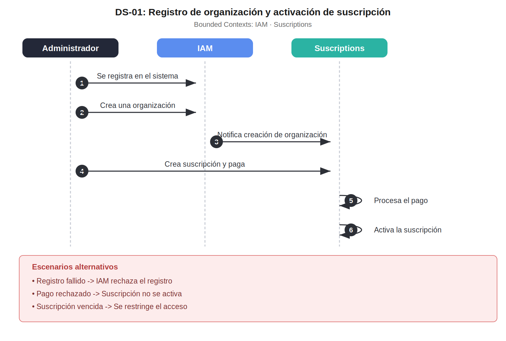
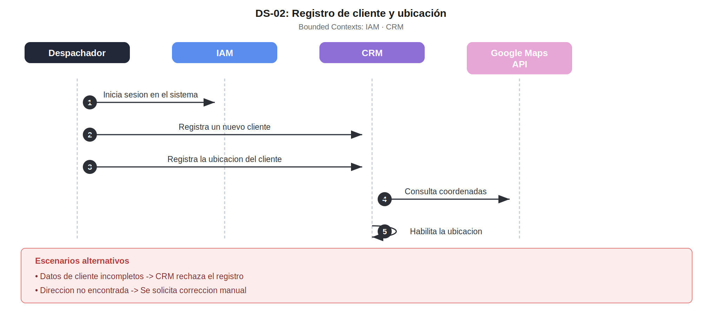
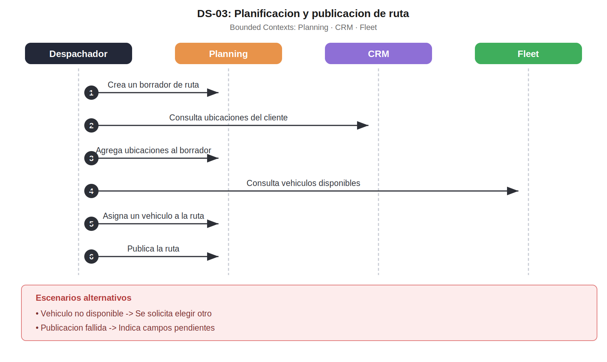
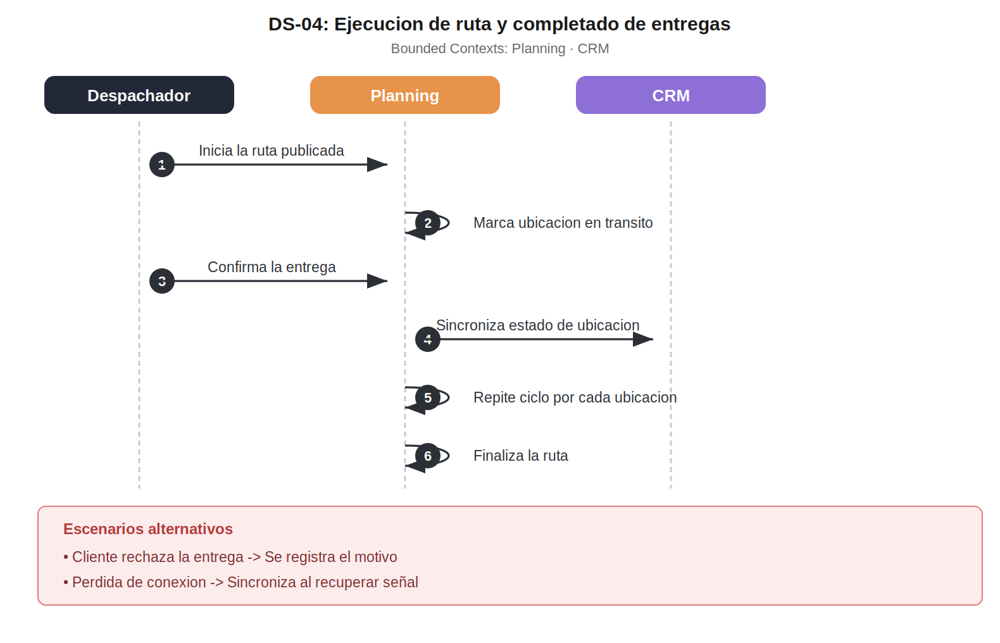
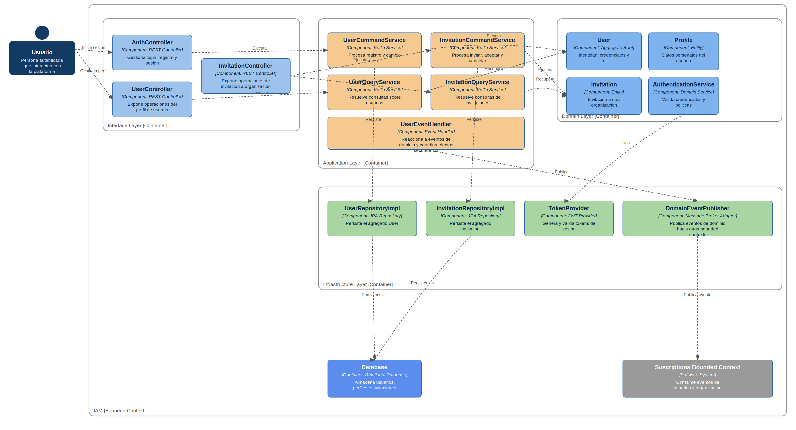
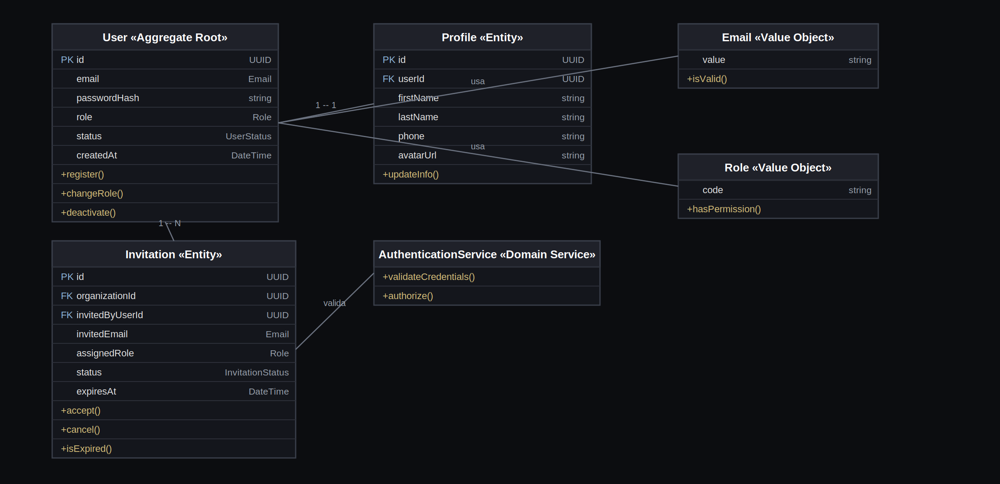
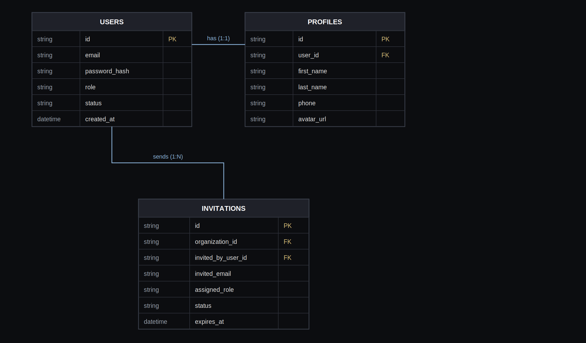

# Capítulo II: Requirements Development and Software Solution Design
## 2.1. Competidores
### 2.1.1. Análisis competitivo
<table style="width:100%; border-collapse:collapse; table-layout:fixed;" border="1" align="center">
  <!-- Título principal -->
  <tr>
    <th colspan="6" align="center">Competitive Analysis Landscape</th>
  </tr>
  <!-- Justificación -->
  <tr>
    <td rowspan="2" align="center"><b>¿Por qué llevar a cabo este análisis?</b></td>
    <td colspan="5" align="center">
      Identificar fortalezas, debilidades y estrategias de los principales competidores en logística de última milla (SimpliRoute, Beetrack, FarEye) para posicionar nuestra aplicación web.
    </td>
  </tr>
  <tr>
    <td colspan="5">
      <b>Objetivo:</b> Determinar cómo diferenciar nuestro producto frente a competidores consolidados en LATAM y globales.   
    </td>
  </tr>
  <!-- Encabezados con logos -->
  <tr>
    <th colspan="2" style="width:20%">(En la cabecera colocar por cada competidor nombre y logo)</th>
    <th style="width:20%">
      
    </th>
    <th style="width:20%">
      
    </th>
    <th style="width:20%">
      
    </th>   
    <th style="width:20%">
      
    </th>
  </tr>
  <!-- PERFIL -->
  <tr>
    <td rowspan="2" align="center"><b>Perfil</b></td>
    <td><b>Overview</b></td>
    <td> Solución tecnológica desarrollada para el mercado peruano que fusiona IoT y GPS para garantizar el seguimiento en vivo, la mejora de rutas y la supervisión de mercancías en tránsito. Está diseñada específicamente para mitigar los retos locales de transporte, tales como la congestión vehicular, los cierres de vías y las variaciones climatológicas. </td>
    <td> Plataforma chilena con fuerte presencia en LATAM; optimización de rutas y seguimiento en tiempo real. </td>
    <td> Fundada en Chile, adquirida por DispatchTrack; fuerte en trazabilidad de última milla. </td>
    <td> Empresa multinacional de origen indio especializada en orquestación de entregas, visibilidad de envíos y gestión inteligente de devoluciones. </td>
  </tr>
  <tr>
    <td><b>Ventaja competitiva: ¿Qué valor ofrece a los clientes?</b></td>
    <td> Ofrece en una sola solución: seguimiento en vivo, validación automatizada de pedidos y alertas inteligentes. Está pensada para pymes peruanas, ayudándolas a reducir errores de entrega, evitar pérdidas y mejorar la puntualidad. </td>
    <td> Reducción de costos logísticos hasta 30% con algoritmos de optimización. </td>
    <td> Experiencia de usuario robusta y alta penetración en empresas medianas/grandes de LATAM. </td>
    <td> Escalabilidad global y capacidad de integración con grandes retailers y 3PL. </td>
  </tr>
  <!-- PERFIL DE MARKETING -->
  <tr>
    <td rowspan="2" align="center"><b>Perfil de Marketing</b></td>
    <td><b>Mercado objetivo</b></td>
    <td> Pequeñas y medianas empresas de transporte y distribución en Perú, con foco inicial en Lima y ciudades con alta informalidad logística como las empresas de provincia también.</td>
    <td> Pymes y grandes empresas de distribución en LATAM. </td>
    <td> Retail, consumo masivo y distribución en varios países de LATAM. </td>
    <td> Retailers, e-commerce y logística global (Asia, Europa, LATAM). </td>
  </tr>
  <tr>
    <td><b>Estrategias de marketing</b></td>
    <td> Evidenciar beneficios cuantitativos (menos errores, más puntualidad) mediante pilotos locales, campañas digitales y casos de éxito adaptados a la realidad peruana.</td>
    <td> Casos de éxito locales, métricas de reducción de costos y demos personalizadas. </td>
    <td> Branding fuerte en trazabilidad y seguridad de entregas; foco en confiabilidad. </td>
    <td> Posicionamiento como solución integral global; alianzas con grandes corporativos. </td>
  </tr>
  <!-- PERFIL DE PRODUCTO -->
  <tr>
    <td rowspan="3" align="center"><b>Perfil de Producto</b></td>
    <td><b>Productos & Servicios</b></td>
    <td> Incluye monitoreo IoT en tiempo real, registro automático de pedidos, panel de control para administradores y alertas de desvíos o incidencias.</td>
    <td> Optimización de rutas, seguimiento en vivo, gestión de flota y analítica. </td>
    <td> PlannerPro (rutas), LastMile (seguimiento), notificaciones y prueba de entrega. </td>
    <td> Administración total de la cadena de distribución, control de logística inversa y trazabilidad instantánea de los envíos. </td>
  </tr>
  <tr>
    <td><b>Precios & Costos</b></td>
    <td> Planes de suscripción flexible y escalonada (básico, estándar y corporativo) adaptados al ecosistema peruano. Permiten iniciar operaciones con un presupuesto reducido y expandir las capacidades conforme la empresa crece. </td> 
    <td> Modelo SaaS flexible según volumen de entregas. </td>
    <td> Suscripción mensual adaptada al tamaño de la operación. </td>
    <td> Tarifas empresariales escalables para operaciones globales. </td>
  </tr>
  <tr>
    <td><b>Canales de distribución (Web y/o Móvil)</b></td>
    <td> El sistema será accesible a través de plataforma web para administradores y conductores, garantizando sincronización en tiempo real entre ambos segmentos. </td>
    <td> Web y app móvil para conductores y administradores. </td>
    <td> Web, app móvil y APIs de integración. </td>
    <td> Plataforma web, apps móviles, integraciones con ERP/CRM. </td>
  </tr>
  <!-- SWOT -->
  <tr>
    <td rowspan="4" align="center"><b>Análisis SWOT</b></td>
    <td><b>Fortalezas</b></td>
    <td> Integración de IoT y validaciones automatizadas que ofrecen una trazabilidad superior a competidores regionales. </td>
    <td> Alta adopción en LATAM; soporte local. </td>
    <td> Reconocimiento de marca y respaldo de DispatchTrack. </td>
    <td> Cobertura global, escalabilidad y capacidad de integración. </td>
  </tr>
  <tr>
    <td><b>Debilidades</b></td>
    <td> Al ser una solución nueva, carece todavía de base de clientes consolidados y casos de éxito reales. </td>
    <td> Menos reconocimiento fuera de LATAM. </td>
    <td> Dependencia de adaptación tras adquisición. </td>
    <td> Puede resultar costosa y compleja para pymes locales. </td>
  </tr>
  <tr>
    <td><b>Oportunidades</b></td>
    <td> Aprovechar el crecimiento acelerado del e-commerce y la digitalización logística en LATAM para posicionarse como alternativa innovadora. </td>
    <td> Crecimiento del e-commerce en LATAM. </td>
    <td> Sinergias con la expansión global de DispatchTrack. </td>
    <td> Expansión en mercados emergentes con alto crecimiento digital. </td>
  </tr>
  <tr>
    <td><b>Amenazas</b></td>
    <td> Competidores consolidados como Beetrack y SimpliRoute ya cuentan con reconocimiento de marca y clientes en el mercado. </td>
    <td> Aparición de nuevos SaaS locales más económicos. </td>
    <td> Competencia fuerte de soluciones globales más completas. </td>
    <td> Regulaciones locales y adaptación cultural en LATAM. </td>
  </tr>
</table>

### 2.1.2. Estrategias y tácticas frente a competidores

Nuestra estrategia frente a competidores como SimpliRoute, Beetrack y FarEye será iniciar con pymes de transporte y distribución en el mercado peruano, ofreciendo una solución accesible y adaptable. A diferencia de los competidores consolidados, priorizaremos la simplicidad de uso, el soporte local y la personalización de funciones según la realidad de cada empresa.

Implementaremos un modelo SaaS modular y escalonado que facilite a las pequeñas empresas una adopción de bajo costo, permitiéndoles expandir capacidades a la par de sus operaciones. Para consolidar la confianza en el mercado nacional, impulsaremos estrategias basadas en pruebas piloto sin costo, validación con casos de éxito locales y un soporte técnico directo y cercano.

Nuestra propuesta de valor destaca por fusionar monitoreo IoT en tiempo real, automatización en la validación de pedidos y un sistema de alertas inteligentes dentro de una plataforma ágil y ligera. Esto se traduce en una reducción drástica de costos operativos, mayor cumplimiento en los tiempos de entrega y una seguridad reforzada frente a los desafíos logísticos del contexto peruano.

## 2.2. Entrevistas
### 2.2.1. Diseño de entrevistas
### 2.2.2. Registro de entrevistas
### 2.2.3. Análisis de entrevistas
## 2.3. Needfinding
### 2.3.1. User Personas
En esta sección se presentan dos User Personas que representan los segmentos del proyecto: los Administradores y los Transportistas. Estos perfiles permiten comprender en profundidad las necesidades, motivaciones, frustraciones y comportamientos de los usuarios potenciales del sistema, el cual busca mejorar el seguimiento de rutas, la gestión de pedidos y el control de las operaciones de transporte.

El User Persona Jorge Caceres representa a los administradores de distribución. Jorge Caceres trabaja coordinando diariamente las rutas de camiones y supervisando la correcta entrega de cientos de pedidos. A pesar de su experiencia en el sector, suele enfrentarse a problemas de visibilidad: no siempre sabe en qué punto exacto se encuentran los transportistas ni si los pedidos han sido entregados en orden y a tiempo. Ha intentado usar otras plataformas de gestión, pero se queja de que son demasiado complejas o poco adaptables a la realidad de su empresa. Su motivación principal es tener un control en tiempo real y sin errores, que le permita optimizar rutas, reducir costos y asegurar la satisfacción de los clientes. Jorge busca una herramienta práctica, intuitiva y confiable que le dé autonomía y reduzca su dependencia de reportes manuales.

El User Persona Luis Gutiérrez representa a los transportistas que realizan las entregas en ruta. Luis tiene tiempo trabajando en transporte de mercancías y conoce de primera mano las dificultades de su labor diaria: rutas mal planificadas, entregas duplicadas o mal registradas y la falta de comunicación clara con los administradores. Actualmente utiliza aplicaciones que le resultan confusas y que generan frustración porque no consolidan pedidos de un mismo cliente, obligándolo a hacer viajes innecesarios y perder tiempo valioso. Su principal motivación es contar con una app sencilla y ágil en su teléfono que le muestre claramente su ruta, los pedidos cargados y entregados. Luis quiere reducir la carga administrativa de su trabajo y enfocarse en lo que mejor sabe hacer: transportar y entregar productos de manera segura y puntual.

### 2.3.2. User Task Matrix
### 2.3.3. User Journey Mapping
### 2.3.4. Empathy Mapping
### 2.3.5. Big Picture EventStorming
### 2.3.6. Ubiquitous Language
| Term (EN)                                         | Definición (ES)                                                                                                                                                           |
| ------------------------------------------------- | ------------------------------------------------------------------------------------------------------------------------------------------------------------------------- |
| Worker (Trabajador / “Administrador” en interfaz) | Persona responsable de gestionar operaciones en la plataforma. No es un administrador del sistema, sino un trabajador operativo que organiza rutas, despachos y entregas. |
| Route (Ruta)                                      | Zona de entregas asignada a un vehículo o trabajador. Define un conjunto de destinos a cubrir en un recorrido.                                                            |
| Traveler (Viajero)                                | Representa una zona de entrega lejana, normalmente asociada a mayor tiempo o distancia de recorrido.                                                                      |
| Local (Local)                                     | Representa una zona de entrega cercana, asociada a distancias cortas o repartos inmediatos.                                                                               |
| Dispatch (Despacho)                               | Despacho de salida, embarque, carga de flota.                                                          |
| Client (Cliente)                                  | Bodega o punto de venta al cual se deben entregar los productos. Cada cliente pertenece a una zona de entrega.                                                            |
| Supplier (Proveedor)                              | Empresa abastecedora de los productos a distribuir. En este caso, corresponde a **Gloria**.                                                                               |
| Delivery zone (Zona de entrega)                   | Sector de reparto, zona operativa, clúster de entrega.                                                                        |
## 2.4. Requirements specification
### 2.4.1. User Stories
### 2.4.2. Impact Mapping
### 2.4.3. Product Backlog
## 2.5. Strategic-Level Domain-Driven Design
### 2.5.1. EventStorming

### 5.2.5.1. Candidate Context Discovery

Se aplicaron las tres estrategias indicadas en el enunciado para identificar los bounded contexts a partir del EventStorm de Rutana.

#### 3.1 Estrategia: Start-with-Value

Se identificaron las partes del dominio con mayor valor para el negocio (core). El sistema tiene como propósito principal la planificación y ejecución de rutas de distribución, gestionando flota, clientes y ubicaciones asociadas.

| Módulo | Valor de Negocio | Tipo de Dominio |
|:----|:----|:----|
| Planning | Creación, publicación y ejecución de rutas — núcleo del sistema | Core Domain |
| Fleet | Registro y disponibilidad de vehículos para las rutas | Core Domain |
| CRM | Gestión de clientes y ubicaciones de entrega | Core Domain |
| Suscriptions | Habilita el acceso a la plataforma según plan contratado | Supporting Domain |
| IAM | Autenticación, organizaciones y gestión de sesiones | Generic Domain |

#### 3.2 Estrategia: Start-with-Simple

Se descompuso el timeline del EventStorm en steps secuenciales para identificar modelos simples con propósito claro. Cada módulo tiene actores y flujos definidos, lo que permite establecer límites claros entre contextos.

| Contexto | Actores Involucrados | Flujo Principal |
|:----|:----|:----|
| IAM | Usuario, Administrador | Registrar cuenta → Iniciar sesión → Crear organización → Invitar usuario |
| Suscriptions | Administrador | Crear organización → Crear suscripción → Realizar pago → Suscripción activada |
| Fleet | Administrador, Despachador | Registrar vehículo → Habilitar vehículo → Actualizar estado operacional |
| CRM | Administrador, Despachador | Registrar cliente → Registrar ubicación → Actualizar posición de ubicación |
| Planning | Despachador | Crear borrador de ruta → Agregar ubicaciones → Asignar vehículo → Publicar ruta → Iniciar ruta → Completar ruta |

#### 3.3 Estrategia: Look-for-Pivotal-Events

Se identificaron los eventos clave del negocio que indican cruces entre diferentes partes del proceso. Estos eventos actúan como fronteras naturales entre bounded contexts.

| Pivotal Event | Contexto Origen | Contexto Destino |
|:----|:----|:----|
| Organization Created | IAM | Suscriptions (creación de suscripción) |
| Subscription Activated | Suscriptions | CRM, Fleet, Planning (habilita uso de la plataforma) |
| Vehicle Registered | Fleet | Planning (Vehicle Assigned to Route) |
| Client Registered | CRM | Planning (asociación de ubicaciones a rutas) |
| Location Created | CRM | Planning (Location Added to Route) |
| Route Published | Planning | Fleet (Dispatcher/Vehicle Assigned) |
| Route Started | Planning | CRM (Location Completed en tiempo real) |

Con estas estrategias pudimos identificar los bounded contexts que obtuvimos en el Event Storming: **IAM**, **Suscriptions**, **Fleet**, **CRM** y **Planning**.

### 2.5.1.2. Domain Message Flows Modeling

Para el desarrollo del Message Flow Modeling utilizamos la técnica de **Domain Storytelling**, un modelado colaborativo en el que los expertos de dominio narran su trabajo. El modelador escucha y registra estas historias usando un lenguaje pictográfico que combina: **Actores** (personas o sistemas de software) • **Objetos de trabajo** (documentos, datos, mensajes) • **Actividades** (flechas numeradas que indican el flujo secuencial) • **Anotaciones** (escenarios alternativos o condiciones de error).

Para cada flujo se identificaron: el actor iniciador, los bounded contexts involucrados, la secuencia de mensajes intercambiados y los escenarios alternativos.

 

#### DS-01: Administrador registra su organización y activa una suscripción

**Historia:** El administrador se registra en el sistema, crea una organización y contrata una suscripción. El sistema procesa el pago y activa el acceso a la plataforma.

**DS-01: Administrador registra su organización y activa una suscripción**
*Bounded Contexts: IAM · Suscriptions*

**Bounded Contexts Involucrados:**
1. IAM — registra al usuario y crea la organización
2. Suscriptions — gestiona el plan, el pago y la activación del acceso

**Flujo Principal:**

|#|Actor|Mensaje / Acción|Destino|Resultado|
|:--:|:----|:----|:----|:----|
|1|Administrador|Se registra en el sistema|IAM|Usuario registrado|
|2|Administrador|Crea una organización|IAM|Organización creada|
|3|IAM|Notifica creación al módulo de suscripciones|Suscriptions|Organización disponible para suscripción|
|4|Administrador|Crea una suscripción y realiza el pago|Suscriptions|Suscripción creada|
|5|Suscriptions|Procesa el pago mediante pasarela de pago|Suscriptions|Pago exitoso|
|6|Suscriptions|Activa la suscripción|Suscriptions|Suscripción activada|

**Escenarios Alternativos:**

|Escenario Alternativo|Respuesta del Sistema|
|:----|:----|
|Registro de usuario fallido|IAM rechaza el registro → Muestra error de validación|
|Pago rechazado|Suscriptions no activa la suscripción → Notifica error de pago|
|Suscripción vencida|Suscriptions marca la suscripción como expirada → Restringe acceso a módulos|

 

#### DS-02: Despachador registra un cliente y su ubicación de entrega

**Historia:** El despachador registra un nuevo cliente en el sistema y, a continuación, registra la ubicación asociada a ese cliente para futuras entregas.

**DS-02: Despachador registra un cliente y su ubicación**
*Bounded Contexts: CRM*

**Bounded Contexts Involucrados:**
1. IAM — autentica al despachador
2. CRM — gestiona el registro del cliente y sus ubicaciones

**Flujo Principal:**

|#|Actor|Mensaje / Acción|Destino|Resultado|
|:--:|:----|:----|:----|:----|
|1|Despachador|Inicia sesión en el sistema|IAM|Sesión iniciada|
|2|Despachador|Registra un nuevo cliente|CRM|Cliente registrado|
|3|Despachador|Registra la ubicación del cliente|CRM|Ubicación creada|
|4|CRM|Consulta coordenadas mediante Google Maps API|Google Maps API|Ubicación geolocalizada|
|5|CRM|Habilita la ubicación para su uso en rutas|CRM|Ubicación habilitada|

**Escenarios Alternativos:**

|Escenario Alternativo|Respuesta del Sistema|
|:----|:----|
|Datos de cliente incompletos|CRM rechaza el registro → Muestra error de validación|
|Dirección no encontrada en Google Maps|CRM marca la creación de ubicación como fallida → Solicita corrección manual|
|Cliente desactivado previamente|CRM impide registrar nuevas ubicaciones para ese cliente|

 

#### DS-03: Despachador planifica y publica una ruta con vehículo asignado

**Historia:** El despachador crea un borrador de ruta, agrega las ubicaciones que debe visitar, asigna un vehículo disponible y publica la ruta para su ejecución.

**DS-03: Despachador planifica y publica una ruta**
*Bounded Contexts: Planning · Fleet · CRM*

**Bounded Contexts Involucrados:**
1. Planning — gestiona el borrador, las ubicaciones y la publicación de la ruta
2. CRM — provee las ubicaciones disponibles del cliente
3. Fleet — provee los vehículos disponibles para la asignación

**Flujo Principal:**

|#|Actor|Mensaje / Acción|Destino|Resultado|
|:--:|:----|:----|:----|:----|
|1|Despachador|Crea un borrador de ruta|Planning|Borrador de ruta creado|
|2|Despachador|Consulta ubicaciones registradas del cliente|CRM|Ubicaciones obtenidas|
|3|Despachador|Agrega ubicaciones al borrador de ruta|Planning|Ubicación agregada a la ruta|
|4|Despachador|Consulta vehículos disponibles|Fleet|Vehículos obtenidos|
|5|Despachador|Asigna un vehículo a la ruta|Planning|Vehículo asignado a la ruta|
|6|Despachador|Publica la ruta|Planning|Ruta publicada|

**Escenarios Alternativos:**

|Escenario Alternativo|Respuesta del Sistema|
|:----|:----|
|Vehículo no disponible|Planning notifica asignación fallida → Solicita elegir otro vehículo|
|Ubicación eliminada del borrador|Planning remueve la ubicación de la ruta y recalcula el recorrido|
|Publicación fallida por datos incompletos|Planning rechaza la publicación → Indica campos pendientes|

 

#### DS-04: Conductor ejecuta la ruta y completa las entregas

**Historia:** El despachador inicia la ejecución de la ruta publicada y el sistema va marcando cada ubicación como completada conforme se realizan las entregas, hasta finalizar la ruta.

**DS-04: Ejecución de ruta y completado de entregas**
*Bounded Contexts: Planning · CRM*

**Bounded Contexts Involucrados:**
1. Planning — gestiona el inicio, avance y finalización de la ruta
2. CRM — refleja el estado de las ubicaciones visitadas

**Flujo Principal:**

|#|Actor|Mensaje / Acción|Destino|Resultado|
|:--:|:----|:----|:----|:----|
|1|Despachador|Inicia la ruta publicada|Planning|Ruta iniciada|
|2|Planning|Marca la primera ubicación en tránsito|Planning|Ubicación en curso|
|3|Despachador|Confirma la entrega en la ubicación|Planning|Ubicación completada|
|4|Planning|Actualiza el estado de la ubicación en CRM|CRM|Estado de ubicación sincronizado|
|5|Planning|Repite el ciclo para cada ubicación de la ruta|Planning|Todas las ubicaciones procesadas|
|6|Planning|Finaliza la ruta|Planning|Ruta completada|

**Escenarios Alternativos:**

|Escenario Alternativo|Respuesta del Sistema|
|:----|:----|
|Cliente rechaza la entrega|Planning marca la ubicación como rechazada → Registra el motivo|
|Pérdida de conexión durante la ruta|Planning almacena los cambios localmente → Sincroniza al recuperar señal|
|Cancelación de ruta en curso|Planning marca la ruta como cancelada → Libera el vehículo asignado|

 

Con estas historias de dominio se evidencia cómo colaboran los bounded contexts **IAM**, **Suscriptions**, **CRM**, **Fleet** y **Planning** para resolver los principales casos de uso del negocio en Rutana.

### 2.5.1.3. Bounded Context Canvases
## 2.5.2. Context Mapping
## 2.5.3. Software Architecture
### 2.5.3.1. Software Architecture Context Level Diagrams
### 2.5.3.2. Software Architecture Container Level Diagrams
### 2.5.3.3. Software Architecture Deployment Diagrams
## 2.6. Tactical-Level Domain-Driven Design
### 2.6.1. Bounded Context: IAM

El bounded context **IAM (Identity & Access Management)** corresponde a un *Generic Domain* dentro de Rutana, encargado de la autenticación, la gestión de identidad de los usuarios y la administración de invitaciones a organizaciones. A continuación se detallan los términos clave de su lenguaje ubicuo:

| Término | Definición |
|:----|:----|
| **User** | Representa la identidad de un usuario dentro del sistema, incluyendo sus credenciales y su rol. |
| **Profile** | Contiene los datos personales asociados a un usuario (nombre, teléfono, avatar). |
| **Invitation** | Representa la invitación enviada a un correo electrónico para unirse a una organización con un rol asignado. |
| **Role** | Define el conjunto de permisos que posee un usuario dentro de una organización. |

 

#### 2.6.1.1. Domain Layer

En esta capa se modelan las clases de categoría como **Entities**, **Value Objects**, **Aggregates**, **Factories** y **Domain Services**, o abstracciones representadas por interfaces como en el caso de los **Repositories**.

- **Aggregate Root:** `User` — encapsula la identidad, credenciales y estado del usuario, y actúa como raíz de consistencia junto con `Profile`.
- **Entities:** `Profile`, `Invitation`.
- **Value Objects:** `Email`, `Role`.
- **Domain Services:** `AuthenticationService` — valida credenciales y aplica las políticas de autorización.
- **Factories:** `UserFactory` — encapsula la creación de un `User` válido a partir de datos de registro.
- **Repositories (interfaces):** `UserRepository`, `InvitationRepository`.

 

#### 2.6.1.2. Interface Layer

En esta sección se introduce y presenta las clases que forman parte de la Interface/Presentation Layer, como clases del tipo **Controllers** o **Consumers**.

- **Controllers:**
  - `AuthController` — expone los endpoints de inicio de sesión y registro.
  - `UserController` — expone las operaciones sobre el perfil del usuario.
  - `InvitationController` — expone las operaciones de invitación a una organización (crear, aceptar, cancelar).

 

#### 2.6.1.3. Application Layer

En esta sección se explica a través de qué clases se manejan los flujos de procesos del negocio. Debe evidenciarse las capabilities de la aplicación en relación al bounded context. Aquí deben considerarse clases del tipo **Command Handlers** e **Event Handlers**.

- **Command Handlers:**
  - `UserCommandService` — procesa el registro de usuarios y el cambio de rol.
  - `InvitationCommandService` — procesa la creación, aceptación y cancelación de invitaciones.
- **Query Handlers:**
  - `UserQueryService` — resuelve las consultas sobre usuarios.
  - `InvitationQueryService` — resuelve las consultas sobre invitaciones.
- **Event Handlers:**
  - `UserEventHandler` — reacciona a eventos de dominio (`UserRegistered`, `InvitationAccepted`) y coordina efectos secundarios hacia otros bounded contexts.

 

#### 2.6.1.4. Infrastructure Layer

En esta capa se presentan aquellas clases que acceden a servicios externos como *databases*, *messaging systems* o *email services*. Es en esta capa se ubica la implementación de los **Repositories** para las interfaces definidas en Domain Layer.

- `UserRepositoryImpl` — implementa `UserRepository` mediante JPA/Spring Data.
- `InvitationRepositoryImpl` — implementa `InvitationRepository` mediante JPA/Spring Data.
- `TokenProvider` — genera y valida los tokens JWT de sesión.
- `DomainEventPublisher` — publica los eventos de dominio hacia el message broker para que otros bounded contexts (como Suscriptions) puedan reaccionar a ellos.

 

#### 2.6.1.5. Bounded Context Software Architecture Component Level Diagrams

En esta sección se presenta el **Component Diagram** de C4 Model correspondiente al bounded context de IAM, reflejando la descomposición del Container en sus principales bloques estructurales (Interface, Application, Domain e Infrastructure Layer) y sus interacciones.

 

#### 2.6.1.6. Bounded Context Software Architecture Code Level Diagrams

En esta sección se presentan los diagramas que muestran un mayor detalle sobre la implementación de componentes en el bounded context de IAM, incluyendo el diagrama de clases del Domain Layer y el diagrama de base de datos.

 

##### 2.6.1.6.1. Bounded Context Domain Layer Class Diagrams

Se presenta el **Class Diagram** en UML de las clases del Domain Layer del bounded context de IAM, incluyendo atributos, métodos, su visibilidad (cuando corresponda) y la multiplicidad de las relaciones entre ellas.

 

##### 2.6.1.6.2. Bounded Context Database Design Diagram

Se presenta y explica el **Database Diagram** que incluye los objetos de base de datos del bounded context de IAM: tablas, columnas, constraints (primary key, foreign key) y las relaciones entre tablas.

